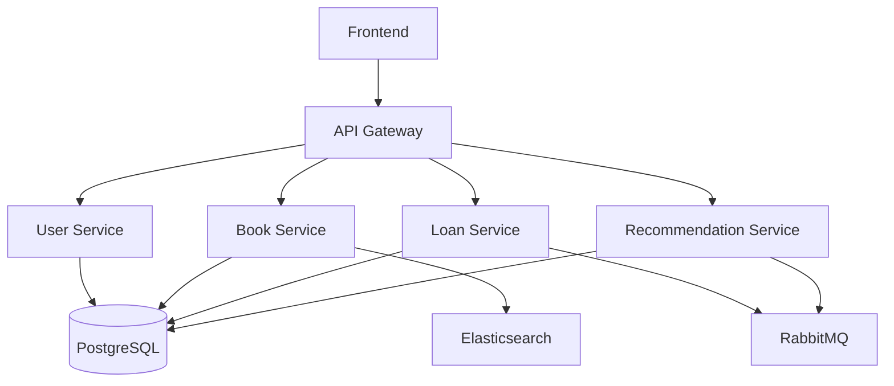

# E-Library Backend - CS4135


A microservices-based digital library system allowing students and staff to browse, borrow, and manage books and academic resources.

### Collaborators
- Róisín Mitchell (21193762)
- Katie Purser (22345477)
- Dara O'Malley (22349243)
- Sohaila Awaga (22367543)
- Oleksandr Kardash (22310975)
- Sophie Ashton (22353313)

---

## Architecture Diagram



---

## Architecture

| Service | Description | Local Port |
|---|---|---|
| api-gateway | Spring Cloud Gateway — single entry point | 8080 |
| user-service | Auth, registration, JWT issuance | 8081 |
| book-service | Book catalogue, cover images (MinIO), search (Elasticsearch) | 8082 |
| loan-service | Borrow/return workflow, email notifications (SendGrid) | 8083 |
| recommendation-service | ML-based book recommendations via RabbitMQ | 8084 |
| embedding-service | Python/FastAPI sentence-embedding sidecar | 8000 |
| config-server | Centralised Spring Cloud Config | 8888 |
| discovery-server | Eureka service registry | 8761 |

Infrastructure: **PostgreSQL**, **Elasticsearch**, **RabbitMQ**, **MinIO**.

---

## Prerequisites

- [Docker Desktop](https://www.docker.com/products/docker-desktop/) (with Compose v2)
- Java 21 (only needed if running services outside Docker)
- Maven is not required for wrapper-based commands. Each Java service includes Maven Wrapper scripts, so you can run `./mvnw` or `mvnw.cmd` without installing system Maven.

---

## Running Locally (Docker Compose)

The `docker-compose.override.yaml` is picked up automatically in development and exposes all service ports to `localhost`.

```bash
# Build and start everything
docker compose up --build -d

# Watch logs
docker compose logs -f

# Stop and remove containers
docker compose down
```

> First startup takes a few minutes — services wait for their dependencies to become healthy before starting.

### Useful local URLs once running

| URL | Purpose |
|---|---|
| http://localhost:8080 | API Gateway (all client traffic goes here) |
| http://localhost:9001 | MinIO console (user: `elibrary`, pass: `elibrary-dev-password`) |
| http://localhost:15672 | RabbitMQ management UI (same credentials) |
| http://localhost:8761 | Eureka dashboard |

---

## Environment Variables

All services have sensible defaults for local development — no `.env` file is required to get started. The defaults are:

| Variable | Default |
|---|---|
| `DB_USERNAME` / `DB_PASSWORD` | `elibrary` / `elibrary-dev-password` |
| `RABBITMQ_USERNAME` / `RABBITMQ_PASSWORD` | `elibrary` / `elibrary-dev-password` |
| `MINIO_USER` / `MINIO_PASSWORD` | `elibrary` / `elibrary-dev-password` |
| `JWT_SHARED_SECRET` | shared dev JWT secret injected into services as `APP_JWT_SECRET` |

For email notifications (loan confirmations), set `SENDGRID_API_KEY`, `SENDGRID_FROM_EMAIL` in a `.env` file — these are optional and the service will still start without them.

> Warning: the default JWT secret is for local development only. Override `JWT_SHARED_SECRET` in `.env` or your deployment environment before running in production.

---

## Running a Single Service Outside Docker (IDE / Hot Reload)

Start only the infrastructure, then run the service locally with the `local` Spring profile, which connects to `localhost` ports. Run the wrapper from the service directory:

```bash
# 1. Start infrastructure
docker compose up postgres elasticsearch rabbitmq minio config-server discovery-server -d

# 2. Run a service (example: book-service)
cd book-service
./mvnw spring-boot:run -Dspring-boot.run.profiles=local
```

---

## Testing

Postman collections are provided in the `postman/` directory:

| Collection | Coverage |
|---|---|
| `E-Library_End-To-End.json` | Full end-to-end happy path |
| `Book-End-To-End.json` | Book service flows |
| `Loan-End-To-End.json` | Borrow / return flows |
| `User-End-To-End.json` | Registration, login, JWT |
| `Recommendation-End-To-End.json` | Recommendation engine |
| `Gateway-End-To-End.json` | Gateway routing & filters |

Import any collection into Postman and point the `baseUrl` variable at `http://localhost:8080`.

A PowerShell script `postman/Test-CircuitBreakers.ps1` is also included to exercise the circuit-breaker / fallback behaviour.
